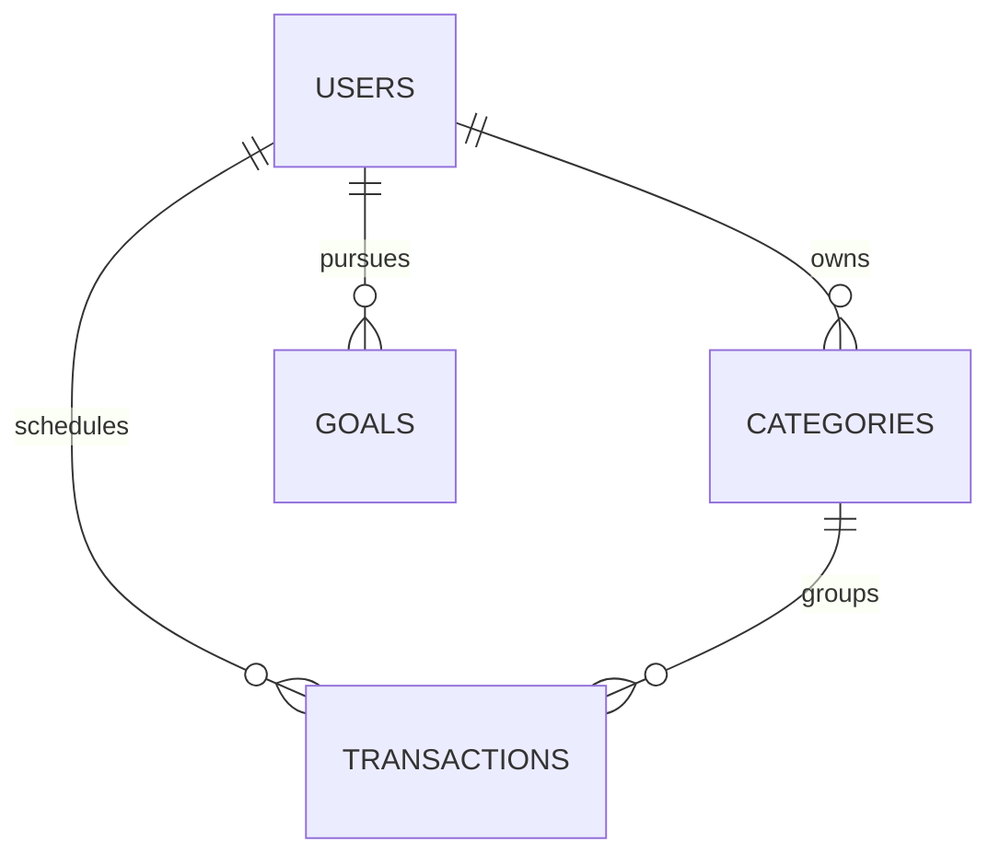

# Routine

Organize your life, one day at a time — uma aplicação pessoal full stack, mobile-first, centrada no dia do usuário.

## Produto

Routine evita dashboards e excesso de métricas. Ao entrar, o usuário encontra uma timeline calma e objetiva, com atividades, duração, categorias e objetivos em foco.

- Home “Hoje” com timeline diária
- Atividades e compromissos persistidos no banco
- Categorias pessoais
- Calendário e filtros por período
- Objetivos com progresso e prazo
- Bottom navigation no mobile
- Feedback visual, skeleton loading e microanimações discretas
- Autenticação JWT e dados isolados por usuário

## Arquitetura

```text
Pessoa → React/Vite → Express REST API → PostgreSQL (Neon)
```

A interface é mobile-first. A API aplica validação server-side, queries parametrizadas, bcrypt, JWT, Helmet, rate limiting e limites de payload. A conexão do banco e os segredos existem somente no backend da Vercel.

## Modelo relacional



As atividades usam data, categoria, tipo, duração e observação. O progresso dos objetivos é calculado no backend a partir das etapas totais e concluídas.

## Desenvolvimento

```bash
cd backend && npm install && npm run dev
cd frontend && npm install && npm run dev
```

Copie `backend/.env.example` para `backend/.env` e configure `DATABASE_URL` e `JWT_SECRET`. Nunca publique credenciais.

## Stack

React 19, React Router, Vite, Lucide, Node.js, Express, PostgreSQL, JWT, bcrypt e Vercel.
